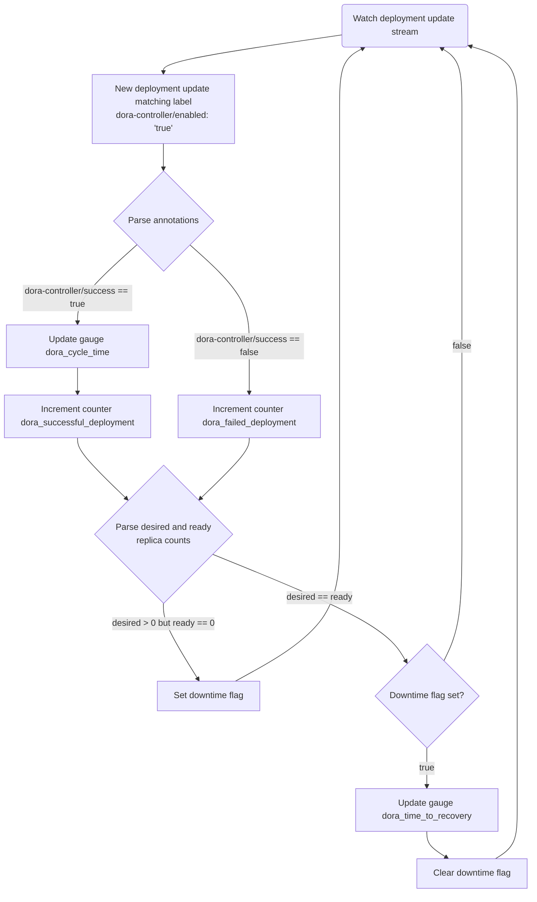

# DORA metrics

## How it works
This controller watches deployments that present label `dora-controller/enabled: 'true'`.

It collects four metrics:

- deployment frequency
- failure rate
- cycle time
- mean time to recovery

These are the four metrics highlighted as worth measuring by the authors of [Accelerate](https://www.amazon.co.uk/Accelerate-Software-Performing-Technology-Organizations/dp/1942788339); they are somewhat arbitrary but as good a starting point as any.

Different teams interpret the exact meaning of the four metrics in ways that make sense to them, which is exactly as it should be. This implementation applies the following:

- deployment frequency is based on the number of successful deployments in production
- failure rate is based on the number of unsuccessful deployments in production
- cycle time is elapsed time between pipeline start (typically triggered by a git commit) and successful rollout
- mean time to recovery (MTTR) is here defined narrowly as the time it takes the cluster to recover from an outage (no healthy pods available) to a healthy deployment

## Flow


## Approach
With the exception of MTTR, the best source for these metrics is the CI pipeline. The CI system knows how long the pipeline runs and crucially it can find out quite easily if a given deployment has completed successfully.

For MTTR, the controller distinguishes broadly between "unavailable" and "available", where availability is defined as a deployment whose number of healthy pods matches the desired count.

In addition to MTTR, there is an opportunity to measure the frequency of outages, but that falls outside the four metrics.

```yaml
  labels:
    dora-controller/enabled: 'true'
  annotations:
    dora-controller/report-before: '1626600056'
    dora-controller/cycle-time: '125'
    dora-controller/success: 'true'
```

The label is used to identify deployments the controller should monitor for state changes.

`report-before` is used to prevent stale attributes being picked up when a deployment changes state (which often happens without a new deployment taking place). This is not necessary for the controller pod that originally picks up this update (as it maintains a map of the previously seen `report-before` value for each deployment), but it is necessary should the controller pod be rescheduled due to a spot instance eviction, for example.

`cycle-time` is the elapsed time, in seconds, from the moment the pipeline was triggered to the moment the deployment completed, successfully or otherwise. Note that time spent in approval stages is deducted from the total.

`success` specifies whether a given deployment was successful.

Crucially, the application itself does no work to expose these metrics.

They are made available to Prometheus by single-pod deployment `dora-metrics` in namespace `kube-monitoring`.

## Building dashboards
The following metrics are exposed to Prometheus:

- `dora_cycle_time_seconds`
- `dora_failed_deployments_total`
- `dora_successful_deployments_total`
- `dora_time_to_recovery_seconds`
