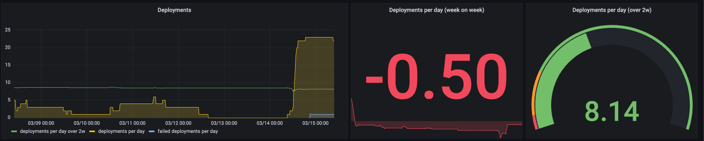
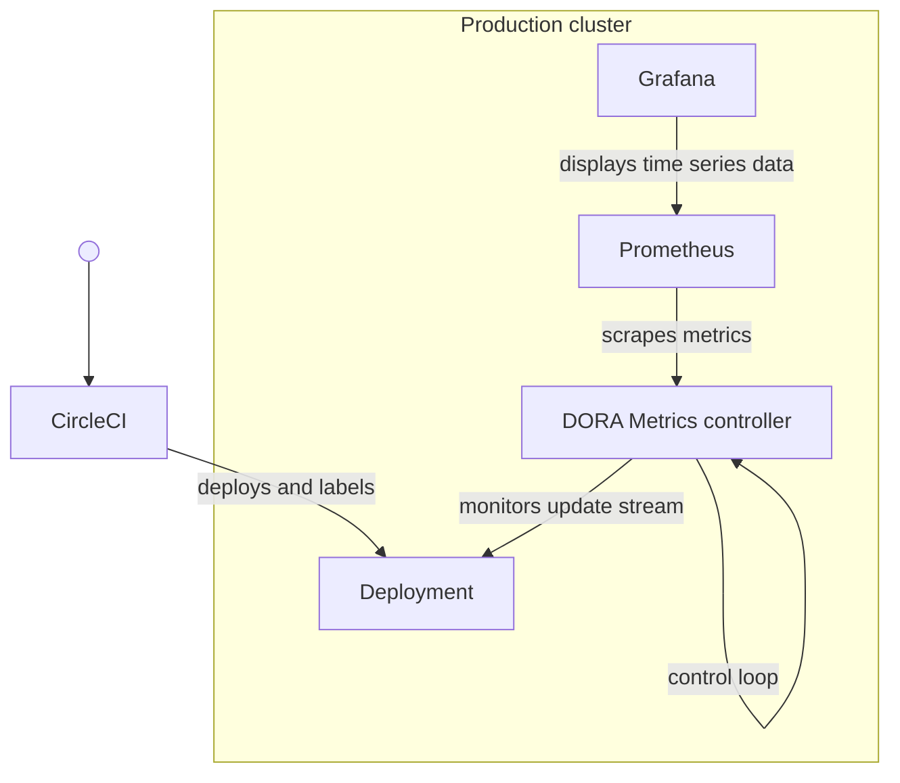
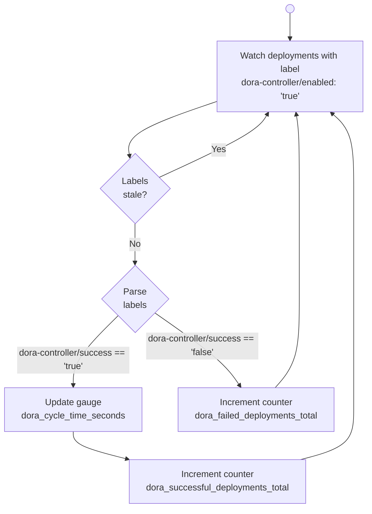
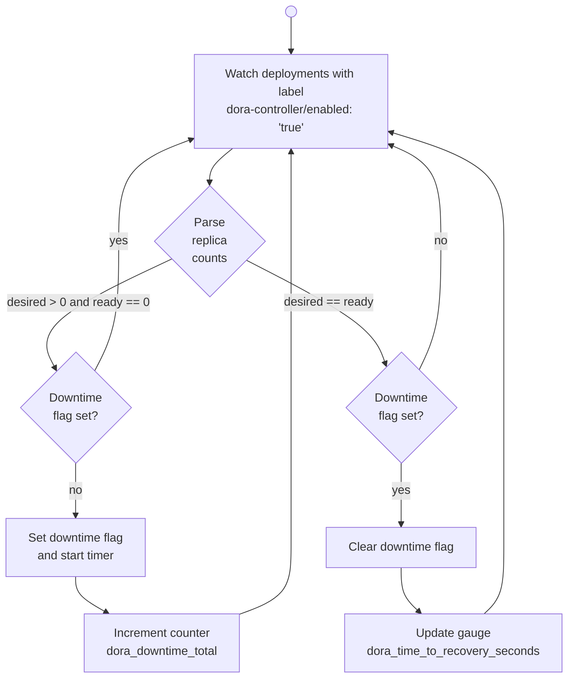
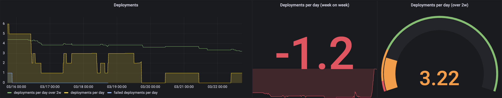
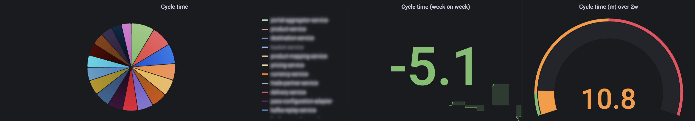
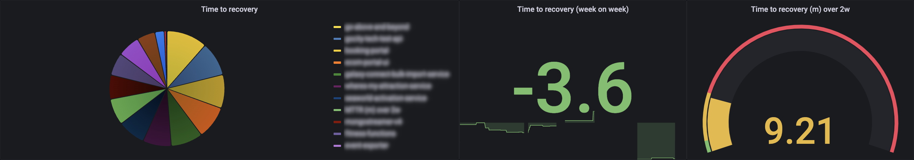
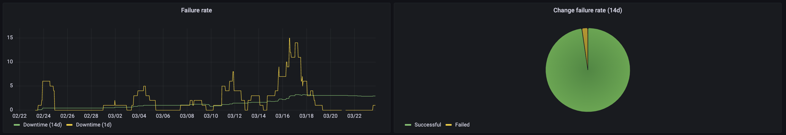

# DORA metrics on a shoestring



When platform teams ask themselves how well they are doing, they could do worse than measure how well the teams using their platform are performing against the "four key metrics": deployment frequency, lead time for changes, mean time to restore and change failure rate. This may seem counter-intuitive, as it means that the platform team's measure of success depends on work done in other teams. I would argue, however, that this is precisely what the platform team's enabling role as described in [Team Topologies](https://teamtopologies.com/book) calls for. This approach incentivises building the best 'curated experience for internal teams using the platform' (to quote [Matthew Skelton and Manuel Pais](https://teamtopologies.com/all-guided-workshops/team-topologies-guided-workshop-define-and-evolve-a-platform-p803)) achievable. It disincentivises silo-formation and any desire to assume a gatekeeper role where self-service is possible and secure. Platform and engineering teams succeed together or not at all.

Soon after the authors of [*Accelerate*](https://itrevolution.com/accelerate-book/) popularised the four key metrics - which have since become the DORA (DevOps Research & Assessment) metrics - engineering teams were faced with the task of actually measuring them. Clearly it would not do to send out an annual questionnaire. It is easy to forget that this is how the original dataset that underpinned *Accelerate* came into being. What is needed is an automated approach.

A number of companies have offered to step in. [sleuth.io](https://sleuth.io) is an example of a commercial DORA metrics offering. As it is not a tool I have used I am not able to comment on strengths or any weaknesses. The mere fact that there is such a service does, however, suggest that this is a problem worth solving.

Another notable entrant, CircleCI, introduced an [API dedicated to the key metrics](https://circleci.com/blog/how-to-measure-devops-success-4-key-metrics/) across a given organisation's pipelines. As ever, who does the measuring has an impact on what is being measured. Lead time, for CircleCI, is elapsed time between pipeline start and pipeline end. (So, considering that a lead time to change of "less than one hour" characterises highly performant teams in their account, were the authors of *Accelerate*.) We are really looking at a measure of cycle time, not lead time. A failed deployment is one whose pipeline does not flag success on completion. Mean time to restore, finally, here indicates how much time has passed between an unsuccessful deployment and a subsequent successful one.

This is hardly satisfactory especially when it comes to recovery from errors. In a majority of cases, a failed deployment to production should change nothing at all. The new workload fails to gain "readiness" in the eyes of the scheduler, and the previous version of the workload keeps serving traffic.

The key metrics, it turns out, require multiple data sources.

John Lewis have described a [fully automated solution to the problem](https://medium.com/john-lewis-software-engineering/john-lewis-partnership-measuring-our-delivery-performance-using-dora-metrics-e017ea6c0988) with two data sources (GitLab and ServiceNow), a microservice, a scheduled job, a queue, a cloud function, a data warehouse and Grafana. The integration of ServiceNow supplies much-needed information about whether services are up or not, which the CircleCI API has no knowledge of. This is an architecture I am sure many teams would love to deploy to address this challenge. I know our platform team would. This post is for the teams that marvel at John Lewis's "DORA Technical Landscape" and then ask "can we have roughly that for less?"

## Focus on reuse
The starting point for the proposed implementation will look familiar to many small to medium-sized platform teams: there's a managed CI/CD solution (CircleCI in our case); there is one Kubernetes cluster per staging environment; and there is a self-hosted Prometheus and Grafana stack deployed in-cluster. The task is to make do with the state Kubernetes maintains for us courtesy of Etcd and the time series storage Prometheus has been configured to use. In short, the plan is to reuse as many existing components of our stack as possible. Here is a 10,000 foot view, focusing solely on the production environment:



Of these components, only the controller is new, and its requirements are modest: it is permitted up to a tenth of a virtual CPU and 64 MB memory, but it reserves half that.

How does it work? The CI/CD tool runs a full deployment, checks whether the deployment has completed successfully, and then labels the deployment object to flag success or failure as well as cycle time.

A typical deployment carries the following annotations and labels:

```yaml
metadata:
  annotations:
    dora-controller/cycle-time: "677"
    dora-controller/report-before: "1647263717"
    dora-controller/success: "true"
  labels:
    dora-controller/enabled: "true"
```

Storing this information in deployment annotations and labels has the advantage that we avoid tight coupling. Any CI/CD tool is suitable. GitLab, ConcourseCI, CircleCI and any other CI/CD tool will know how long a deployment took and whether it succeeded or not. Add these annotations and labels, and three of the four key metrics are within our grasp.

This information will go stale after a while (the `report-before` property guards against this) and we need to avoid duplication, but most of the information we need is now readily available. The most striking exception is "time to restore", and this is something we will come back to.

## A meaningful yet affordable interpretation of the key metrics
No two systems devised to measure the four key metrics interpret them in quite the same way. The contrast between the CircleCI and John Lewis implementations exemplifies this. Engineering organisations have without doubt come up with excellent solutions that were so tightly bound up with their platform that releasing to the public them would have been difficult if not impossible. Before going much further in the direction of the proposed solution, then, it is worth describing what we are hoping to measure.

### Deployment frequency
This metric, a measure less of engineering throughput than of batch size, helps us distinguish between teams relying on long-running feature branches and teams that have brought batch size down to a level that encourages thorough review and multiple daily deployments. It may be the most visible of the four metrics in corporate settings because it lends itself so well to being an input to objectives and key results (OKRs).

Here the deployment frequency is simply the number of successful deployments to a given environment.

### Lead time for changes
Definitions of lead time can be as wide as "from the time a product or feature appears on our board to successful completion" and as sharply defined as CircleCI's "from pipeline start to successful completion". I vividly remember one delivery lead counting up days on a whiteboard in prison wall notation.

We chose an adaptation of the CircleCI approach, which as we saw earlier is essentially an admission that we can only measure cycle time automatically and with confidence. We begin with the time it takes the CI/CD tool to run a deployment end-to-end (this is the signal the CircleCI implementation uses) before subtracting any time spent in approval steps.

Why stop there? We could have gone on to count elapsed time from a feature branch's initial commit rather than the merge commit that triggered the release we're dealing with. Why didn't we attempt this? One problem is that while our measurement gains intrinsic meaning (how long did it take us to deploy this feature?), the values obtained are harder to interpret. Should we count weekend days? Bank holidays? What about feature branches that lie dormant for a day or two while the team races to resolve an urgent production issue? To arrive at a useful lead time measure we would either need to gather a lot more data (e.g. track time spent on tickets) or go back to tally marks on a whiteboard.

### Mean time to restore
There were a number of options available here - we have touched on the CircleCI approach of measuring the time it takes to recover from a broken pipeline - but we chose the fundamental metric of downtime. The clock starts when a deployment drops to zero workloads in "ready" state at a time when one or more are meant to be running. It stops when the deployment returns to full strength. It seemed excessive to count a single replica going missing as downtime (there could be several others happily serving traffic), but equally the bar for "restoration" had to be higher than just a single healthy replica.

### Change failure rate
This rate is simply the proportion of production deployments that end in failure rather than success.This is admittedly a weak point in the current setup. It is trivial to report the percentage of rollouts that fail in the production environment, but this rate is not as meaningful as it could be because builds that fail usually fail early on: during testing, building and deployment to staging environments. For the vast majority of failed builds, the production rollout never happens, and thus the CI/CD tool has no means of annotating the deployment.

One could argue, however, that teams also do not get credit for deployments that never reach the production environment. In that sense, a low failure rate paired with frequent deployments does say something about the engineering maturity of the team.

While the change failure rate may not be a strength of the proposed system, the workload failure rate is available with no additional effort. Every time the timer measuring time to recovery fires, a matching downtime counter is incremented. That gives us a reliable figure for failures over time, taking into account both failed deployments and faults that occur at runtime.

## One event loop, two workflows
The controller observes the update stream of deployments that carry the label `dora-controller-enabled: "true"`. Each time a deployment in scope updates - that is, when its status changes in any way, not just on restart - the controller examines its latest state and triggers two separate workflows.

### Deployment status


The deployment status workflow underpins deployment frequency, cycle time and change failure rate. Note the initial step of excluding stale labels and annotations. The deployment object offers a convenient carrier for DORA information, but its lifecycle can span weeks or months while these annotations are meaningful only for a minute or less. The `dora-controller/report-before` annotation allows the controller to disregard annotations for the many changes deployment objects undergo that are unrelated to cycle time and deployment success.

### Uptime status
Updates signalling downtime or steps on the path to recovery, by contrast, are never out of scope. Controllers watching deployments are among the first components to be alerted to replicas becoming unavailable (and hopefully soon regaining availability). This rapid feedback loop facilitates the following downtime detection workflow:



Only the metric `dora_time_to_recovery_seconds` feeds into one of the key metrics, but the counter `dora_downtime_total` unlocks the workload failure rate (as a companion metric to the change failure rate). Paired with a suitably short Prometheus scrape interval, the counter also offers a passable signal for operational alerts.

## The dashboard
The arrangement of the dashboard (or dashboards) for our metrics will differ significantly from team to team. The controller exposes the following metrics:

* `dora_cycle_time_seconds`
* `dora_time_to_recovery_seconds`
* `dora_successful_deployments_total`
* `dora_failed_deployments_total`
* `dora_downtime_total`

Each metric carries two custom labels: `deployment` and `namespace`.

One convenient arrangement for deployment frequency, for example, is a Time Series graph charting successful and failed deployments per day, as well as the trendline of successful deployments over two weeks. Next to it could be placed a Stat graph showing the change week-on-week. Finally, the team could use the goal it has set for itself by adding green, amber and red banding to a Gauge graph.



As we are in fact measuring cycle time, not lead time, it makes sense to refer to it as such. One straightforward representation is a pie chart showing each deployment's cycle time in order, accompanied by a week-on-week view and a Gauge calibrated to the team's preference. In this example, the team has brought cycle time down by five minutes, but still falls short of the sub-ten minute mark that corresponds to green for this metric.



The proposed template for "time to restore" looks very similar: there is a pie chart ordering deployments in relation to one another, an indication of the weekly trend and a gauge with red, amber and green banding.



The next row juxtaposes the failure rate time series (which can make sobering reading) and the change failure rate (which tends to emphasise success because failures in earlier stages are not shown).



The final row digs deeper into the successful deployments, highlighting the share of individual namespaces and deployments respectively.


## Reflection
Looking back, the most difficult decision was to forgo dedicated persistence for these metrics. Depending on the storage we make available to Prometheus, our visibility may stretch no further than four or even two weeks back. This is where John Lewis's "DORA Technical Landscape" with its cloud-based data warehouse shines.

It is clearly desirable to trace the organisation's performance against the DORA metrics month-on-month or even quarter-on-quarter. As it is, the ingress tier is likely to have filled much of our available metrics storage after a couple of weeks. One solution would be to run an additional Prometheus instance for long-lived, low cardinality metrics such as these.

The strength of the current implementation is that it allows us to see where we are on our DevOps maturity journey at little cost. If what we learn proves valuable, we have every reason to ensure historical data is retained for half a year at least.

## The source
If you would like to deploy the controller, you are very welcome to clone the repo [github.com/gocityengineering/dora-metrics](https://github.com/gocityengineering/dora-metrics). The sample Grafana dashboard is available in the folder [dashboard](https://github.com/gocityengineering/dora-metrics/tree/main/dashboard). If you happen to be a CircleCI user, you will find that [our orb](https://circleci.com/developer/orbs/orb/leisurepassgroup/common-k8s) containing the "deployment-metrics" command is in the public domain too.
